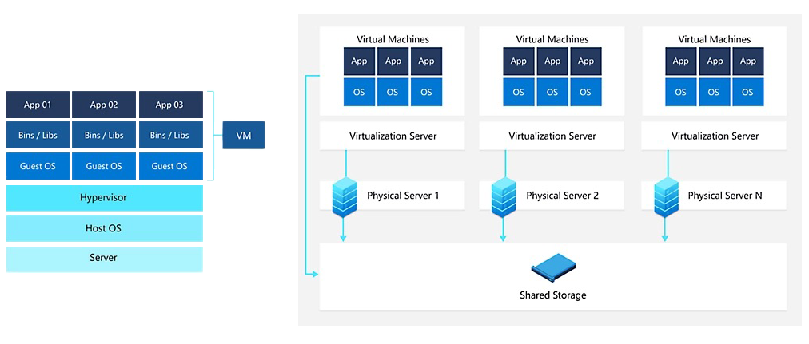

# Virtual machines: virtual computers within computers

A virtual machine, commonly shortened to just VM, is no different than any other physical computer like a laptop, smart phone, or server. It has a CPU, memory, disks to store your files, and can connect to the internet if needed. While the parts that make up your computer (called hardware) are physical and tangible, VMs are often thought of as virtual computers or software-defined computers within physical servers, existing only as code.

## How does a virtual machine work?

Virtualization is the process of creating a software-based, or "virtual" version of a computer, with dedicated amounts of CPU, memory, and storage that are "borrowed" from a physical host computer—such as your personal computer— and/or a remote server—such as a server in a cloud provider's datacenter. A virtual machine is a computer file, typically called an image, that behaves like an actual computer. It can run in a window as a separate computing environment, often to run a different operating system—or even to function as the user's entire computer experience—as is common on many people's work computers. The virtual machine is partitioned from the rest of the system, meaning that the software inside a VM can't interfere with the host computer's primary operating system.

## What are VMs used for?

Here are a few ways virtual machines are used:

- Building and deploying apps to the cloud.
- Trying out a new operating system (OS), including beta releases.
- Spinning up a new environment to make it simpler and quicker for developers to run dev-test scenarios.
- Backing up your existing OS.
- Accessing virus-infected data or running an old application by installing an older OS.
- Running software or apps on operating systems that they weren't originally intended for.

## What are the benefits of using VMs?

While virtual machines run like individual computers with individual operating systems and applications, they have the advantage of remaining completely independent of one another and the physical host machine. A piece of software called a hypervisor, or virtual machine manager, lets you run different operating systems on different virtual machines at the same time. This makes it possible to run Linux VMs, for example, on a Windows OS, or to run an earlier version of Windows on more current Windows OS.

And, because VMs are independent of each other, they're also extremely portable. You can move a VM on a hypervisor to another hypervisor on a completely different machine almost instantaneously.

Because of their flexibility and portability, virtual machines provide many benefits, such as:

- **Cost savings**—running multiple virtual environments from one piece of infrastructure means that you can drastically reduce your physical infrastructure footprint. This boosts your bottom line—decreasing the need to maintain nearly as many servers and saving on maintenance costs and electricity.
- **Agility and speed**—Spinning up a VM is relatively easy and quick and is much simpler than provisioning an entire new environment for your developers. Virtualization makes the process of running dev-test scenarios a lot quicker.
- **Lowered downtime**—VMs are so portable and easy to move from one hypervisor to another on a different machine—this means that they are a great solution for backup, in the event the host goes down unexpectedly.
- **Scalability**—VMs allow you to more easily scale your apps by adding more physical or virtual servers to distribute the workload across multiple VMs. As a result you can increase the availability and performance of your apps.
- **Security benefits**— Because virtual machines run in multiple operating systems, using a guest operating system on a VM allows you to run apps of questionable security and protects your host operating system. VMs also allow for better security forensics, and are often used to safely study computer viruses, isolating the viruses to avoid risking their host computer.

---

Source: [https://azure.microsoft.com/en-us/resources/cloud-computing-dictionary/what-is-a-virtual-machine](https://azure.microsoft.com/en-us/resources/cloud-computing-dictionary/what-is-a-virtual-machine)
