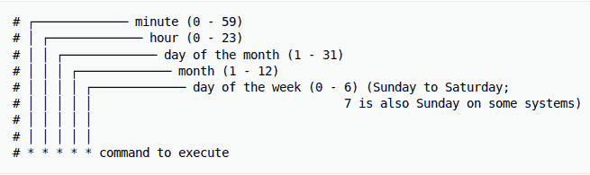
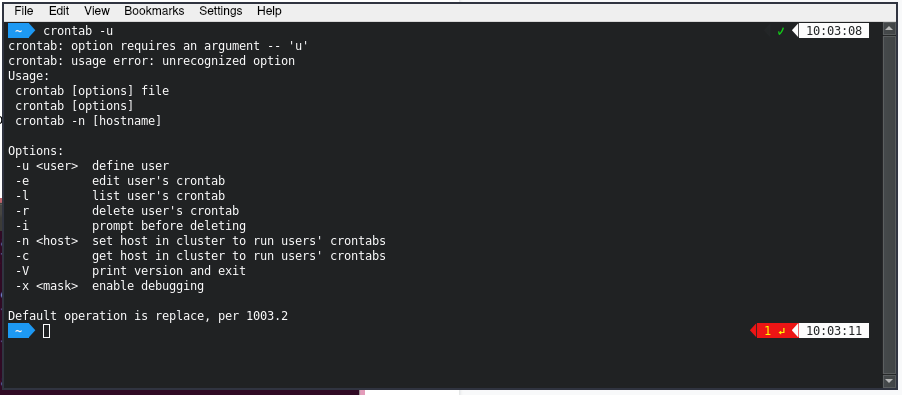

# Cron Job

## What Is a Cron Job

A **cron job** is a task automated using **cron**, a scheduler tool on a Unix system like Linux. Creating cron jobs helps improve web development and management efficiency, as you don’t need to execute the same tasks repeatedly.

For example, automating tasks like downloading files for backups or updating packages in a virtual private server is a common cron job use case.

In this article, we will explain the basics of cron jobs, their types, syntax, special strings, and permissions. We will also share cron job best practices and provide command examples to help you understand how to use cron jobs.

### How Cron Jobs Work

Cron is a daemon – a background process executing non-interactive jobs. In Windows, it works similarly to background processes like **Services**.

A **cron file** is a text file that contains commands to run periodically at a specific time. The **cron table** or **crontab** configuration file is `/etc/crontab` by default.

Only system administrators can edit the system crontab file. However, since Unix-like operating systems support multiple admins, users can create their own files to schedule specific jobs.

With cron jobs, users can automate system maintenance, disk space monitoring, and backups at regular intervals. Due to their convenience, cron jobs are ideal for computers that work 24/7, such as a virtual private server.

While cron job scheduling is popular among system administrators, it is also useful for web developers.

For instance, they can set up three cron jobs to automatically back up a site every day at midnight, check for broken links every Monday at midnight, and clear its cache every Friday at noon.

While convenient, there are several limitations of cron jobs:

- **The shortest interval between jobs is 60 seconds**. Users can only set the cron job interval settings to one minute or more.
- **Missed jobs need a manual reset**. Admins can’t distribute cron jobs to multiple computers on a network. So, if the computer running cron crashes, the scheduled tasks won’t execute. You must restart the missed jobs manually.
- **No auto-retry mechanism**. Cron is designed to run at a given schedule. If a task fails, it won’t run until the next scheduled time. This makes cron unsuitable for incremental tasks.
- **No environment variables**. Crontab can’t read the environment variables from several files containing configuration data that is required to run some applications properly.

Even with these limitations, cron is an excellent solution for running simple and repetitive tasks at a scheduled time. If you want to automate a one-time job, we recommend using another scheduling method instead.

> **Pro Tip**
>
> Before creating a cron job, ensure your script works. To do that, open the file in your browser by URL or execute it via SSH, depending on the script’s type. If it doesn’t work, contact your hosting provider’s support team for help.

## Crontab Syntax

When preparing for cron jobs, you must understand cron’s syntax and formatting to ensure the script runs properly. The [[Commands and settings/Crontab]] consists of five fields with the following possible values:

- **Minute.** The minute of the hour the command will run, ranging from **0-59**.
- **Hour.** The hour the command will run, ranging from **0-23** in a 24-hour notation.
- **Day of the month**. The date of the month the user wants the command to run, ranging from **1-31**.
- **Month**. The month that the user wants the command to run. It ranges from **1-12**, representing January until December.
- **Day of the week.** The day of the week for a command to run, ranging from **0-6**. The value represents Sunday-Saturday. In some systems, the value 7 represents Sunday.

If you don’t have a specific value, avoid leaving these fields blank and enter an asterisk instead. For example, if you want the cron daemon to run the **root/backup.sh** script every Friday at 5:37 pm, here’s what the cron command should look like:

`37 17 * * 5 root/backup.sh`

In the example above, **37** and **17** represent 5:37 pm. Both asterisks for the **Date** and **Month** fields signify all possible values. This means the task should run regardless of the date or month. Finally, **5** represents Friday. The task will then follow this outlined schedule.

If you’re unsure about manually writing the cron syntax, use free tools like [Crontab Generator](https://crontab-generator.org/) or [Crontab.guru](https://crontab.guru/) to generate the exact numbers for the time and date of your command.

In addition to the syntax, you must understand the cron job operators to modify the value in each field. You must properly use these operators in all crontab files to ensure your commands run:

- **Asterisk (*)**. This operator signifies all possible values in a field. For example, write an asterisk in the **Minute** field to make the cron job run every minute.
- **Comma (,)**. An operator for listing multiple values. For example, writing **1,5** in the **day-of-week** field will schedule the job to run every Monday and Friday.
- **Hyphen (-)**. Users can determine a range of values. Write **6-9** in the **Month** field to set up a cron job from June to September.
- **Separator (/)**. This separator divides a value. If you want to run a script every twelve hours, write ***/12** in the **Hour** field.
- **Last** **(L)**. Users can use this operator in the **day-of-month** and **day-of-week** fields. For example, writing **3L** in the **day-of-week** field means the last Wednesday of the month.
- **Weekday** **(W)**. An operator that determines the closest weekday from a given time. For example, if the **1st** of a month is a Saturday, writing **1W** in the **day-of-month** field will run the command on **Monday the** **3rd**.
- **Hash** **(#).** An operator for the **day-of-week** field that determines a specific day of the month, using a number between **1** to **5**. For instance, **1#2** means the second Monday of the month.
- **Question mark** **(?)**. This operator inputs **no specific value** for the **day-of-month** and **day-of-week** fields. It’s typically replaced with the cron daemon start-up time.

> **Pro Tip**
>
> In Vixie cron, you can combine separators with ranges to specify step values, such as **1-2/12**. To learn more about operator usage, read the [cron manual](https://man.freebsd.org/cgi/man.cgi?crontab).

### Cron Syntax Examples

After understanding cron jobs, you are now ready to implement them in your tasks. In this section, we’ll provide some examples of cron job applications.

Note that cron automatically sends the output to your local email account. If you want to stop receiving emails, you can add `>/dev/null 2>&1` to a command similar to the following example:

`0 5 * * * /root/backup.sh >/dev/null 2>&1`

To send the cron output to a specific email account, add `MAILTO` and the desired email address. Here is an example:

`MAILTO="inbox@domain.tld"`

`0 3 * * * /root/backup.sh >/dev/null 2>&1`

To help you better understand the cron syntax, here’s a list of sample commands to conduct system management with cron jobs:

| **Example**                                        | **Explanation**                                                                                                    |
| -------------------------------------------------- | ------------------------------------------------------------------------------------------------------------------ |
| `0 0 * * 0 /root/backup.sh`                        | Perform a backup every Sunday at midnight.                                                                         |
| `0 * * * 1 /root/clearcache.sh`                    | Clear the cache every hour on Mondays.                                                                             |
| `0 6,18 * * * /root/backup.sh`                     | Backup data twice a day at 6 am and 6 pm.                                                                          |
| `*/10 * * * * /scripts/monitor.sh`                 | Perform monitoring every 10 minutes                                                                                |
| `*/15 * * * * /root/backup.sh`                     | Perform a backup every 15 minutes.                                                                                 |
| `* * 20 7 * /root/backup.sh**`                     | Perform a backup every minute on July 20.                                                                          |
| `0 0 * * 2 * /root/backup.sh`                      | Perform a backup at midnight every Tuesday.                                                                        |
| `* * * 1,2,5 * /scripts/monitor.sh`                | Perform monitoring every minute in January, February, and May.                                                     |
| `10-59/10 5 * * * /root/clearcache.sh`             | Clear the cache every 10 minutes at 5 am, starting from 5:10 am.                                                   |
| `0 8 1 */3 * /home/user/script.sh`                 | Make the task run quarterly on the first day of the month at 8 am.                                                 |
| `0 * * * * /root/backup.sh`                        | Create a backup every hour.                                                                                        |
| `* * * * * /scripts/script.sh; /scripts/scrit2.sh` | Include multiple tasks in a single cron job. This is useful for scheduling multiple tasks to run at the same time. |
| `@reboot /root/clearcache.sh`                      | Clear the server cache every time you turn on the system.                                                          |
| `0 8 1-7 * 1 /scripts/script.sh`                   | Run a script on the first Monday of each month at 8 am.                                                            |
| `5 4 * * 0 /root/backup.sh`                        | Create a backup every Sunday morning at 4:05 am.                                                                   |
| `15 9 1,20 * * /scripts/monitor.sh`                | Perform monitoring at 9:15 pm on the 1st and 20th of every month.                                                  |
| `@hourly /scripts/monitor.sh`                      | Perform monitoring every hour.                                                                                     |
| `0 0 1,15 * 3 /scripts/script.sh`                  | Run a script at midnight every Wednesday between the 1st and 15th of every month.                                  |
| `15 14 1 * * /root/clearcache.sh`                  | Clear the cache on the first day of every month at 2:15 pm.                                                        |
| `15 6 1 1 * /root/backup.sh`                       | Perform a backup every January 1st at 6:15 am.                                                                     |
| `0 0 * * * /scripts/monitor.sh`                    | Run the monitoring script once a day at midnight.                                                                  |
| `0 0 15 * * /root/clearcache.sh`                   | Clear the cache at midnight on the 15th of every month.                                                            |

## Cron Job Special Strings

Special strings are used to schedule cron jobs at certain time intervals without specifying the exact values. To use them, write a simple phrase starting with an **@**. Here are some useful special strings to use in commands:

- `@hourly` The job will run once an hour.
- `@daily` or `@midnight`. These strings will run the task every day at midnight.
- `@weekly` A string for scheduling tasks once a week at midnight on Sunday.
- `@monthly` This special string runs a command once on the first day of every month.
- `@yearly` Use this string to run a task once a year at midnight on January 1st.
- `@reboot` This string runs the cron job once during a system startup.

> **Important!** Be careful when scheduling cron jobs for different time zones, and make sure your configuration is correct.

## Cron Permissions

Ensure to set proper permissions for your system’s cron files to allow the jobs to run. You can create or edit two files to set the permissions – `cron.allow` and `cron.deny`.

If `/etc/cron.allow` exists, it should contain a username permitted to run the cron job automation. However, if your system has `/etc/cron.deny` containing a username, that account can’t use cron.

## How to Run Cron Jobs

Cron is commonly pre-installed by default in all Linux distributions. Otherwise, run the installation command according to your package manager. Here’s the command for **Ubuntu** with `apt`:

`sudo apt install cron`

Before proceeding with the basic cron job operations, you must understand the configuration files – the `system crontab` and `user crontab`.

The `system crontab` is used to schedule system-wide essential jobs that are only editable by those with root privileges. Meanwhile, leverage the `user crontab` to create and edit jobs that only apply at the user level.

To edit the system crontab, ensure the current user has root privileges. Read on to learn several basic operations that cron can perform.

### Using a Cron Job to Create a Crontab File

Enter the snippet below into the command line to edit an existing crontab file. If your system doesn’t have it, the command will automatically create a new one.

`crontab -e`

When entering **crontab -e** for the first time, it will ask you to choose which text editor you want to edit the file with, such as **nano** or **vi**. In the text editor, you can add other commands or edit existing ones.

### Using Cron Job to Display a List of Active Scheduled Tasks

To see a list of active, scheduled tasks in your system, enter the following command:

`crontab -l`

If your system has multiple users, you can view their crontab file lists by entering the command below as a superuser:

`crontab -u username -l`

### Using Cron Jobs to Grant Yourself Root Access

Due to user privilege restrictions, some commands can only run using root permissions. To give yourself root privileges, attach **sudo su** to the beginning of the command.

For example, you need `sudo su` to run a crontab command that edits other users’ scheduled jobs:

`sudo su crontab -u username -e`

In addition, you can add cron jobs to the `etc/cron.d` directory to store automatic installation and update scripts. To add them to this directory, you must have root access and conform to [run-parts](http://manpages.ubuntu.com/manpages/trusty/man8/run-parts.8.html) naming conventions.

Alternatively, a root user can move their cron job scripts into the following directories to schedule their execution:

- `/etc/cron.hourly/` Run the script once an hour.
- `/etc/cron.daily/` Run it once a day.
- `/etc/cron.weekly/` Run it once a week.
- `/etc/cron.monthly/` Run it once a month.

### Using a Cron Job to Delete Scheduled Tasks

To delete all scheduled tasks in the crontab entries and start from the beginning, type the following command:

`crontab -r`

Alternatively, use the `crontab -i` command. It is similar to the previous one, except you will get a confirmation option before removing the crontab:

`crontab -i`

## **Conclusion**

Cron daemon is a service in a Unix-based system that lets you create automation scripts for scheduling tasks. Meanwhile, cron jobs are the tasks automated using this tool, such as updating, installing, or monitoring a system.

To automate tasks, write the crontab command in your system’s cron file. The command contains the script for execution and five asterisks referring to the cron job’s execution time. Change the value of these asterisks and use the operators to modify the time.

To run a cron job, connect to your Linux operating system using Terminal, an SSH client, or another CLI application with root permission. Then, create a crontab file and add the script using a text editor like Nano.

---

Source: [https://www.hostinger.com/tutorials/cron-job](https://www.hostinger.com/tutorials/cron-job)
