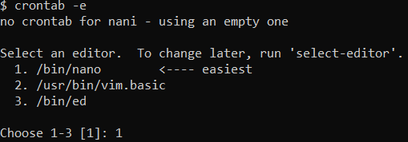
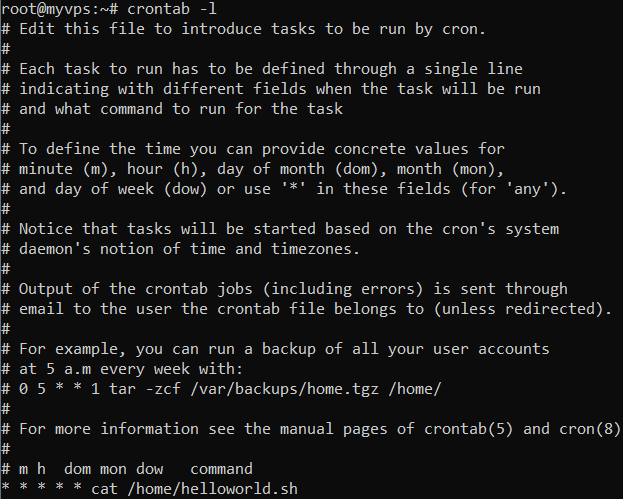
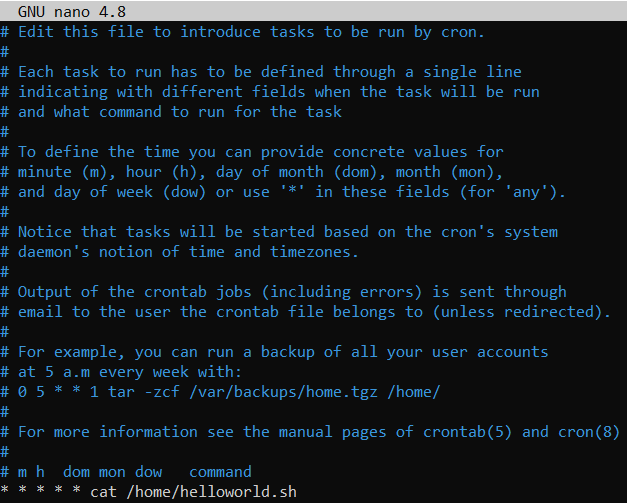

# Crontab

Regarding cron jobs, three terms can be highlighted:

**Cron daemon (crond) or simply cron** – an executable that allows users to perform tasks and run them automatically at a specific time.

**Cron job** – any task a user schedules using cron is known as a [[Commands and settings/Cron Job]].

> #### What Is Crontab Syntax?
>
> **Cron table** or **crontab** is a file containing all schedules of the cron jobs a user wants to run regularly. Commands are written one per line and instructs the cron daemon to run a task at a specific time.

Crontab Format and Values

For the cron daemon to understand instructions correctly, the correct crontab syntax must be used. Crontab syntax consists of five fields. Each one can be filled with any of the values as shown in the following table:

| **Field**    | **Possible values**                                                            |
| ------------ | ------------------------------------------------------------------------------ |
| Minute       | 0-59                                                                           |
| Hour         | 0-23                                                                           |
| Day of month | 1-31                                                                           |
| Month        | 1-12                                                                           |
| Day of week  | 0-6. 0 depicts Sunday. In some systems, a value of 7 represents Sunday instead |
| Command      | Command to execute                                                             |

Aside from possible crontab values, some special characters need to be memorized:

| **Symbol**        | **Meaning**                                             | **Example**                                                                                      |
| ----------------- | ------------------------------------------------------- | ------------------------------------------------------------------------------------------------ |
| *(asterisk)       | Select all possible values in a field                   | Place * in the **hour** field to run the task every hour                                         |
| , (comma)         | A comma is used to separate multiple values             | 0,3,5 in the **day of week** field will make the task run on Sunday and Wednesday                |
| – (hyphen)        | Used to set a range of values                           | 10-15 in the **day of month** field will run the task from the 10th to the 15th day of the month |
| / (separator)     | A separator is used to divide values                    | */10 in the **hour** field will make the task run every 10 hours                                 |
| L                 | Used in the **day of month** or **day of week** fields  | 1L in the **day of week** field will run the task on the last Monday of a given month            |
| W                 | W is used to determine the closest weekday              | 0W in the **day of month** field will make the task run on the nearest Sunday of a given month   |
| \# (hash)         | Used to determine the **day of week**                   | 2#3 in the **day of month** field will make the task run on the third Tuesday of the month       |
| ? (question mark) | Used in the **day of month** and **day of week** fields | ? in the **day of month** field will read as **no specific value**                               |

> **Important!** Note that all fields must be filled when creating a cron job. If you don’t want to specify a field, fill it in with the *** (asterisk)** symbol.

## Crontab Commands

Only a few cron commands are used in the command-line, thus making it easy to create, delete, and manage cron entries:

`crontab -e –` used to edit system `crontabs`. This command will create a new crontab if it has not been made yet.

`crontab -l` – used to view crontab entries (cron jobs) and display system crontab file contents.

`crontab -r` – will remove the current crontab file.

`crontab -i` – will show a prompt before removing a user’s crontab. Highly recommended to use it together with the `-r` flag, making the flag `-ri`.

## How to Use Crontab: Examples of Crontab Syntax

First, use the crontab command to create your first crontab entry:

`crontab -e`

You will be asked to choose an editor. We recommend using **nano**, the first option in our example:

Afterward, you will be redirected to the crontab file. To add new entries, simply choose a new line and proceed with the cronjob.

> **Important!** Keep in mind that crontab uses the system’s current time and date, which means that the time zone is shared with the root system.

### Schedule a Job for a Specific Time

One of the simplest ways to test out cron is to schedule a job for a specific time. For example, the following cron job will execute our **.sh script** at the specified time, which is **August 15th**, at **3:30pm**.

`30 08 10 06 * cat /helloworld.sh`

### View Crontab Entries

Since all the cron jobs are stored in a crontab file, you can view the ones that are already running. To do so, use the following command to display the contents of your crontab files:

`crontab -l`

### Edit Crontab Entries

In order to modify already existing crontab entries, use this command:

`crontab -e`

### Schedule a Job for Every Minute

It is effortless to schedule tasks to run every minute. In the following example, we will instruct the **cat** command execution to run periodically:

`* * * * * cat /home/helloworld.sh`

### Schedule a Background Job Every Day

To schedule a background job to run every day, you can use the **@daily** cron command:

`@daily cat /home/helloworld.sh`

Mind that the script will be executed at **12am** every day.

### Schedule a Job for a Certain Range of Time

It is possible to schedule a job for a specific range of time. For example, every weekday, including weekends, from **8am** to **5pm**. The end result would look like this:

`00 08-17 * * * cat /home/helloworld.sh`

Here’s another example of the same cron, but just on the weekends:

`00 08-17 * * 6-0 cat /home/helloworld.sh`

### Schedule a Cron Job at the Beginning of Every Month

In order to schedule a job at the beginning of every month, you can use the `@monthly` operator:

`@monthly cat /home/helloworld.sh`

Keep in mind that this will execute the job at **12am** on the first day of every month. Similarly, there is a `@yearly` operator who will run the job on the **first day** of every year.

### Schedule a Job for More Than One Time

Users can schedule a cron job to be executed more than once, for example, five times a day. In the following example, we will set up a job to run at **12pm**, **3pm**, **5pm**, **7pm** and, **9pm**.

`0 12,15,17,19,21 * * * cat /home/helloworld.sh`

### Run a Linux Command After Each Reboot

Similarly to **@daily**, **@monthly**, and **@yearly** operators, bash also comes with a **@reboot** command. Users can use it to schedule a job that will be executed each time the system reboots or gets restarted:

`@reboot cat /home/helloworld.sh`

### Where Is the Crontab File Located?

Depending on the system’s operating system, crontab will be located at three different locations:

- **MacOS** – `/var/at/tabs`
- **Debian-based systems** – `/var/spool/cron/crontabs/`
- **Red Hat-based systems** – `/var/spool/cron`

## Additional Crontab Actions

Apart from the current functionality, crontab is also capable of additional actions such as creating a cron execution log or disabling email notifications. Check the sections below for more information.

### Create a Log File

The easiest way to log all outputs from cron jobs is to use the following logic:

`* * * * * cat /home/helloworld.sh >> /var/log/logs.log 2>&1`

This command will save all cron jobs outputs to a file named **logs.log**

### Disable Email

Since cron sends an email to the user after each job, disabling this functionality can be beneficial to avoid spam. Just add this line at the end of your cron job:

`>/dev/null 2>&1`

### Crontab Environment

Crontab allows its users to define environment variables. This can be done with the aforementioned `crontab -e` command. When defining variables, refer to the list below:

- `PATH` – default path for crontab.
- `SHELL` – default shell.
- `LOGNAME` – crontab owner. Information is taken from the `/etc/passwd` directory.
- `HOME` – user’s home directory. Information is taken from the `/etc/passwd` directory.

## Conclusion

Cron jobs are one of the best ways to perform scheduled tasks for virtual instances and physical Linux systems. With cron jobs, users can schedule various tasks for their system. For example, perform system maintenance on a particular day or even schedule it to be run every weekday.

In this tutorial, we’ve covered the majority of crontab operations. We’ve also provided some practical examples that you can use when creating a crontab.

If you have any questions or insights, feel free to leave a comment in the comments section.

---

Source: [https://www.hostinger.com/tutorials/crontab-syntax](https://www.hostinger.com/tutorials/crontab-syntax)
